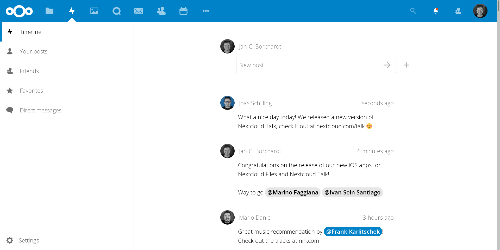

# Nextcloud Social

**🎉 Nextcloud becomes part of the federated social networks!**

- **🙋 Find your friends:** No matter if they use [☁ Nextcloud Social](https://github.com/nextcloud/social#nextcloud-social), [🐘 Mastodon](https://joinmastodon.org), [🅿️ Pleroma](https://pleroma.social) and soon [📺 PeerTube](https://joinpeertube.org) or [📷 PixelFed](https://pixelfed.org) – you can follow them!
- **📜 Profile info:** No need to fill out more profiles – your info from Nextcloud will be used and extended.
- **👐 Own your posts:** Everything you post stays on your Nextcloud!
- **🕸 Open standards:** We use the established [ActivityPub](https://en.wikipedia.org/wiki/ActivityPub) standard!
- **🎨 Nice illustrations:** Made by [Katerina Limpitsouni of unDraw](https://undraw.co).

For more information about about our motivation and goals, read [the announcement blog.](https://nextcloud.com/blog/nextcloud-introduces-social-features-joins-the-fediverse/)

The app is in beta stage, so it’s time for you to [get involved! 👩‍💻](https://github.com/nextcloud/social#development-setup)

For a roadmap, see our [development milestones](https://github.com/nextcloud/social/milestones) - feel free to pick up any of the tasks which are not yet in progress!

## Emojis

Please follow [this guide](https://docs.nextcloud.com/server/stable/admin_manual/configuration_database/mysql_4byte_support.html) to enable the Emojis in the Social app.

## Reset app

If you want to reset all Social app data e.g. to change the domain used for Social, you can use `occ social:reset` (For how to use occ commands see documentation: [using the occ command](https://docs.nextcloud.com/server/latest/admin_manual/configuration_server/occ_command.html)).

## Development setup

1. ☁ Clone the app into the `apps` folder of your Nextcloud: `git clone https://github.com/nextcloud/social.git`
2. 👩‍💻 Run `make dev-setup` to install the dependencies
3. 🏗 To build the Javascript whenever you make changes, run `make build-js`
4. ✅ Enable the app through the app management of your Nextcloud
5. 🎉 Partytime! Help fix [some issues](https://github.com/nextcloud/social/issues) and [review pull requests](https://github.com/nextcloud/social/pulls) 👍

