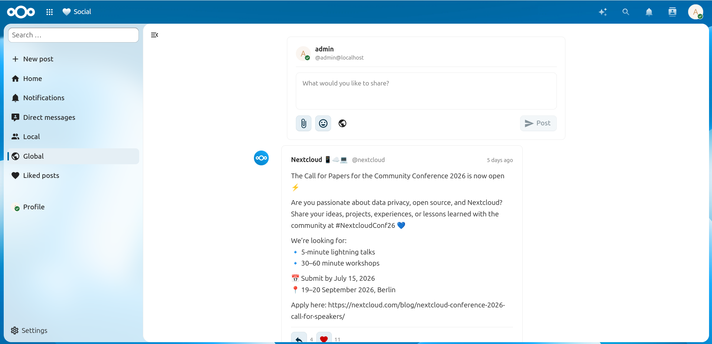

# Nextcloud Social 🚀✨

Nextcloud Social is an ActivityPub-enabled app that integrates your Nextcloud account with the Fediverse. It lets your Nextcloud instance act as a lightweight federated social server: create, edit and distribute posts; follow remote accounts; and interact with likes, boosts and replies.



Short summary: This app implements ActivityPub and enables Fediverse functionality inside Nextcloud.

## 🔧 Features

- 🧭 Timelines — browse public, local and home timelines
- ✍️ Composer — create posts, replies and mentions
- ✏️ Edit posts — edit local posts
- 👍 / 🔁 / 💬 Post actions — like, boost (announce), reply
- 🧾 Profiles — avatar, header/banner and metadata support
- 🌐 Federation — send and receive ActivityPub activities (Create, Like, Announce)
- 🔎 Discovery — webfinger and remote user discovery
- ⚙️ Backend — persistence, queues and signature support for reliable delivery

## 📦 Quickstart (install & develop)

1. Clone this repository into your Nextcloud `apps/` directory.
2. Follow the setup and dependency steps in [DEPLOYMENT.md](DEPLOYMENT.md).
3. Rebuild frontend assets after UI changes:

```bash
cd /var/www/nextcloud/apps/social
./build-package.sh    # produces build/artifacts/social.tar.gz
```

4. Enable the app in Nextcloud and test using a local account.

## 🖼️ Banner / Header upload — Troubleshooting

Banner/header uploads are supported and stored on the server, and should be referenced from the local actor/account cache.

If an uploaded banner does not appear immediately:

- Reload the profile page (clear browser cache if necessary).
- Verify the uploaded file exists in Nextcloud's file storage.
- Check server logs for upload or permission errors.
- Re-fetch the account data or sign out/sign in to refresh the local cache.

## 🛠️ Contributing

- Contributions welcome — open a pull request and run the build/tests locally before merging.
- Reset local Social data for development with:

```bash
occ social:reset
```

## License

See the repository's license files in the `LICENSES/` directory.
