<div align="center">


# Nextcloud Social

### Your Nextcloud is a Fediverse server.

Post, follow and reply across Mastodon, Pixelfed, PeerTube, GoToSocial and Akkoma —
from the same place your files, calendar and chat already live.
No new account. No new app. No algorithm. No advertising.

</div>

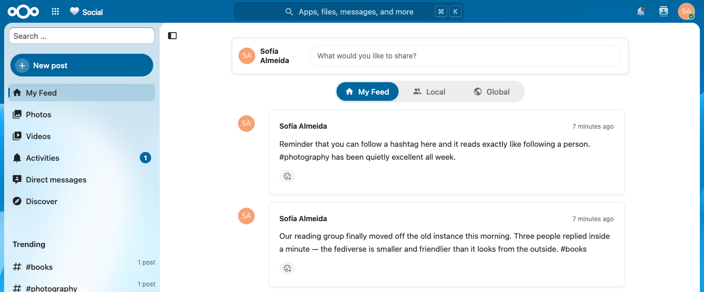

Nextcloud Social gives every user on your server a real Fediverse identity —
`@you@your.cloud` — that anyone on Mastodon can follow, mention and reply to. What you
write leaves your server signed, and lands in their timeline. What they write comes
back into yours. Nobody else holds it, nobody sells it, and nobody reorders it.

It is a **partial** implementation of ActivityPub and of the Mastodon client API:
enough to post, follow, read, converse, moderate and run an instance — and honest
about what it is not. Read [Not implemented yet](#-not-implemented-yet) before you
make it somebody's only Fediverse client.

---

## ✍️ Write

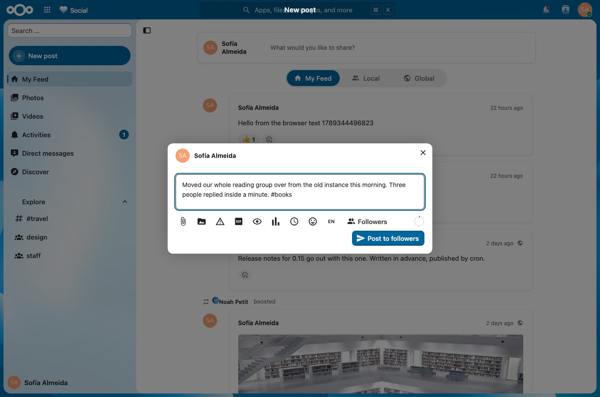

One box, and everything a post can carry.

- **A place on a post** — the pin in the composer names where a picture was taken,
  from the places people here have already posted from or a name you type; the
  marker under the post opens a page of everything public taken there. Nothing is ever
  sent to a map service to work a location out.
- **Say who sees it.** Public, unlisted, followers-only or direct, chosen per post from
  the default you set once. A reply inherits the audience of the post it answers, and
  starts addressed to everyone in the conversation rather than to one person.
- **Pictures, video and audio.** JPEG, PNG, GIF, WebP, AVIF and **HEIC/HEIF straight
  off an iPhone** (transcoded on the way in), MP4, WebM and QuickTime, MP3, AAC, Opus,
  WAV and FLAC. Video is never re-encoded and is streamed to storage a chunk at a time,
  so it gets a **2 GB** ceiling rather than the 10 MB a picture is held to.
- **And the files people actually have.** PDF, text, Markdown, CSV, ZIP, EPUB, ODF
  and the Office formats ride on a post too (`DOCUMENT_MIME_TYPES` in
  `lib/Service/CacheDocumentService.php`), stored as they are and drawn as a card you
  press to download. On the wire they are an ActivityPub `Document` carrying its mime
  type, which Mastodon shows as a link and another Nextcloud shows as a file.
- **Every picture is stripped of its metadata** before it is stored or sent — Exif,
  XMP, IPTC, and the GPS coordinates a phone quietly attaches. Done on the container
  rather than by re-encoding, so nothing loses a generation of quality, and the colour
  profile is deliberately kept.
- **Alt text that actually gets written.** Every attachment has a description field,
  and a post carrying an undescribed picture says so before it goes. A nudge, never a
  refusal.
- **A focal point.** Click or drag a crosshair over a picture to say where the subject
  is, so a square crop never cuts somebody's head off. It federates, so other servers
  crop it correctly too.
- **Seven adjustments**, previewed live and baked into the copy that is posted.
- **Polls.** Up to four options, single or multiple choice. Votes federate both ways
  and the new totals come back as an `Update`.
- **Content warnings** that fold the post away — and keep it out of the page entirely
  until a reader asks for it.
- **Custom emoji.** Type `:shortcode:` and the post travels with a matching `Emoji`
  tag, so it renders on servers that have never heard of it.
- **A GIF picker backed by the instance's own library** — no Giphy, no Tenor, nobody's
  tracker.
- **Quote a post**, with the original author's permission carried on the wire (FEP-044f).
- **Say what language it is in**, starting from your Nextcloud language.
- **Send it later.** Pick a time at least five minutes out and Post becomes Schedule.
- **Mentions and hashtags** typed by hand become real recipients and real tags.

## 📖 Read

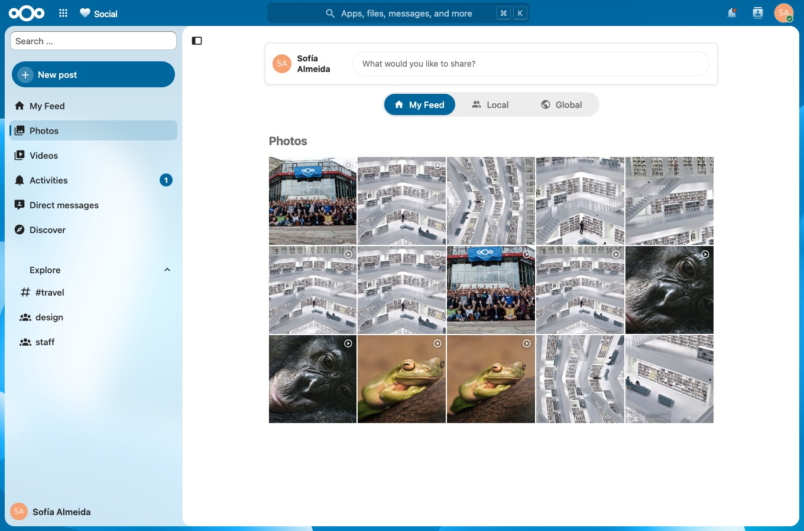

**My Feed**, **Local** and **Global** are a switcher above the posts rather than three
places to navigate to — one pill slides between them, and the arrow keys move through
them. **Photos** and **Videos** carry the same switcher, so the pictures of the people
you follow, of this instance and of the whole Fediverse are one click apart.

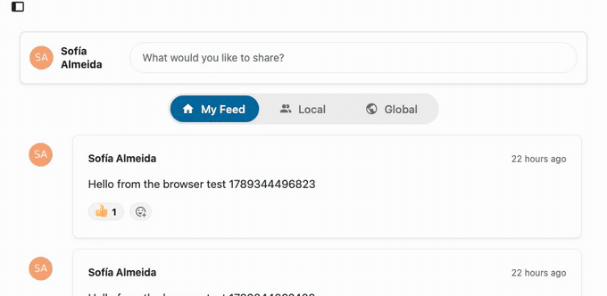

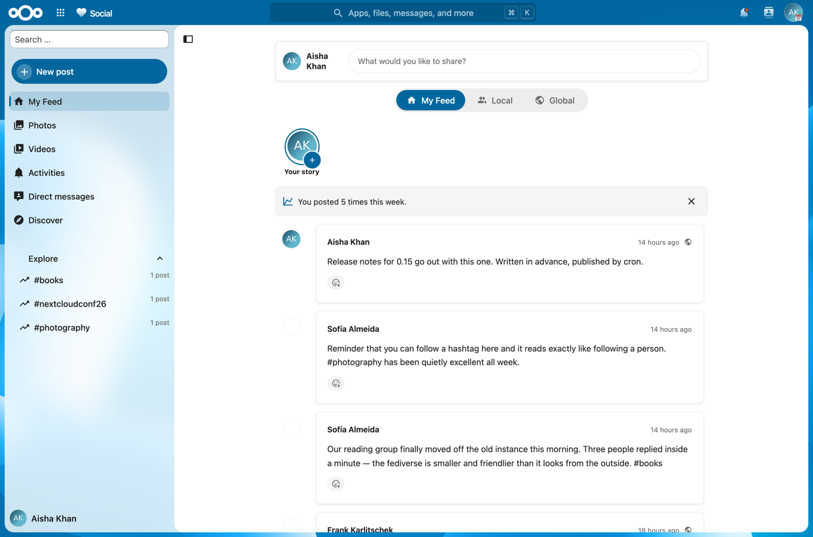

- **Stories** — a row of faces above your feed: whose stories are up. One picture or
  video, for followers, gone after a day; a ring on the face while there is something
  you have not seen, a player that runs them one after another, and your own place
  first in the row with a **+** on it to add one. The poster sees how many people
  watched and can take it down early; nobody else sees either. Stories federate to
  Pixelfed, in the shape Pixelfed actually reads — an `Add` carrying a capability its
  inbox fetches the story with, measured field by field against Pixelfed's own source
  rather than against the specification. One that arrives is held no longer than a day
  here whatever the sender says. You can answer one with an emoji or a line of text,
  and the poster is told and sees what was said; watching one posted elsewhere sends a
  receipt to its author, so their own server can count it. The other direction is not ours to fix: Pixelfed sends
  stories only to instances it has identified as Pixelfed.
- **Photos and Videos are timelines of their own**, drawn as grids and asked of the
  server rather than filtered out of a page you already have.
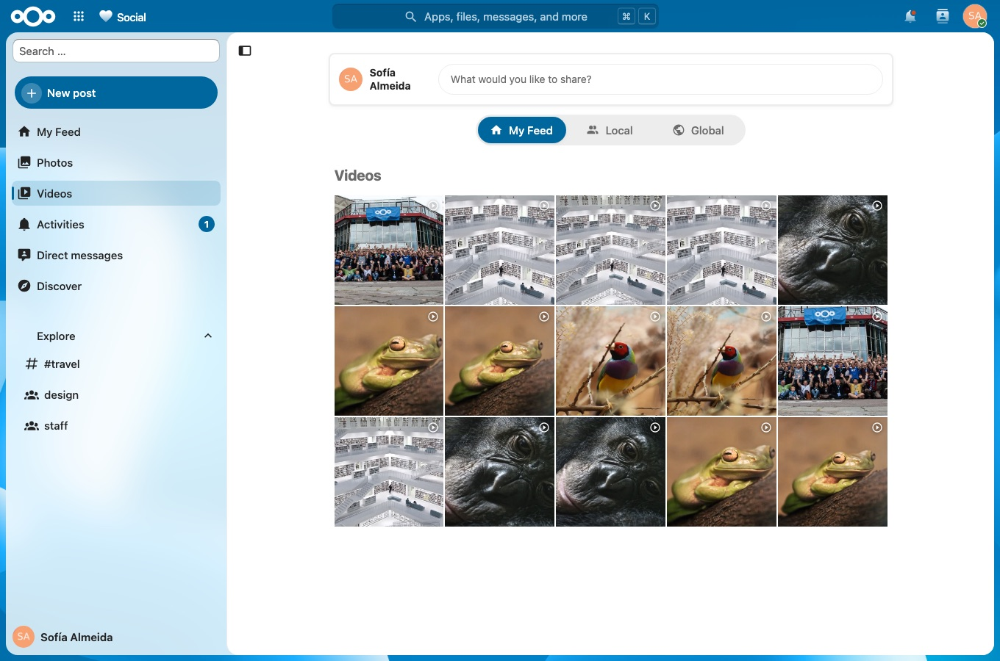

- **PeerTube, properly.** A PeerTube video arrives with its title, its channel, its
  thumbnail and something to play. The video **streams from the instance that holds
  it** — a two-hour talk is not something to mirror onto somebody's Nextcloud — and is
  proxied, so nobody's IP address reaches a server they never chose to talk to. Posts
  that are one video go out as an ActivityPub `Video`, the only shape PeerTube ingests.
- **How many people read it** — on your own posts and nobody else's, counted when
  somebody opens the post rather than scrolls past it, and never sent to another
  server. Three likes means something different out of five readers than out of four
  hundred, and until now there was no way to know which.
- **Blurhash placeholders**, so a timeline never jumps as pictures load, and blurred
  previews for anything marked sensitive.
- **An ALT badge on every described picture**, wherever it is drawn, that shows the
  description when pressed.
- **Lists**, made and filled in Settings or from anybody's profile — and **every
  Nextcloud group you are in is already a list**, built and maintained by nobody.
- **Follow a hashtag** and it reads exactly like following a person.
- **Filter out words you would rather not read** — **Settings → Filtered words**. A
  filter is a handful of words, the timelines it applies in, and whether a matching
  post is **folded away behind the filter's name**, with a *Show anyway*, or taken out
  of the timeline altogether; it can be set to expire on its own. A folded post is not
  in the page at all until you ask for it, so nothing is read by accident. Nobody is
  told, nothing is deleted, and what is currently being taken away is said at the top
  of the page rather than left to be noticed as gaps in a conversation.
- **Bookmarks and favourites**, each with a page of their own.
- **Announcements from your administrators** at the top of the timeline, above the
  composer. An unread one interrupts; **Got it** marks it read for your account on
  every device, and it does not come back. What you have already read is kept out of
  the way behind one line, and an emoji reaction is the one thing you can say back.
- **Keyboard throughout**: `j` `k` `l` `f` `b` `r` `o` `n` `g`, and `?` for the list.
- **Live** when [notify_push](https://github.com/nextcloud/notify_push) is installed;
  polling every 30 seconds when it is not.

## 🧵 Converse

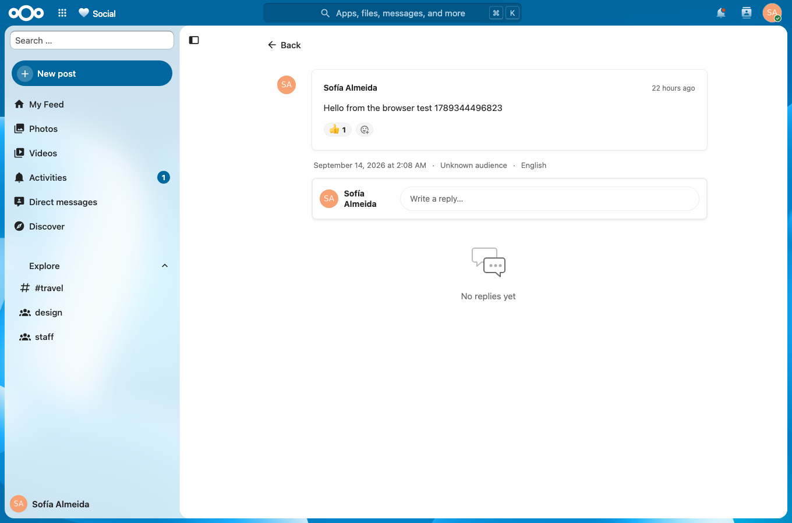

A post opened from a timeline gets a page of its own: the post, a reply box already
pointed at it, the faces behind the boost and favourite counts, and the details a card
leaves out — when exactly, to whom, in what language, whether it has been edited, and a
link to the original for a post from another server.

Replies read as a conversation. Each reply is followed by the replies to it, oldest
first, stepped in by how deep it sits with a line down its side. A reply whose parent
this server does not hold keeps its place in time rather than disappearing. When the
thread shown is shorter than the reply count, the page says so instead of presenting
what it has as the whole conversation.

**Four things you can do to a post**: reply, boost, favourite, and **react with an
emoji** — which federates as `EmojiReact` and shows who reacted with what.

**Archive it** — off your profile and out of every timeline, hashtag page and search
on this server, with nothing sent to anybody and a way back from Settings. It is the
answer to "this no longer belongs on my profile" that is not destroying it: other
servers keep what they already have, which is what deleting is for.

**And two more to your own.** Edit it, or **delete and write it again** — the correction
people actually make. The post goes everywhere it reached, and its words, content
warning, audience, language and pictures come back in the composer; the pictures by
reference, so nothing is uploaded twice. What you post next is a new post, and the
dialog says so before anything happens: the boosts, likes and replies the old one
collected stay with it and are gone.

**A post in another language offers to be translated**, where this Nextcloud has a
translation provider — the same one Talk, Mail and the assistant use. The translation
appears in place of the post and says which provider produced it, because a reader is
entitled to know they are reading a machine. A server without a provider draws no
button at all rather than handing back the original text.

## 🧭 Discover

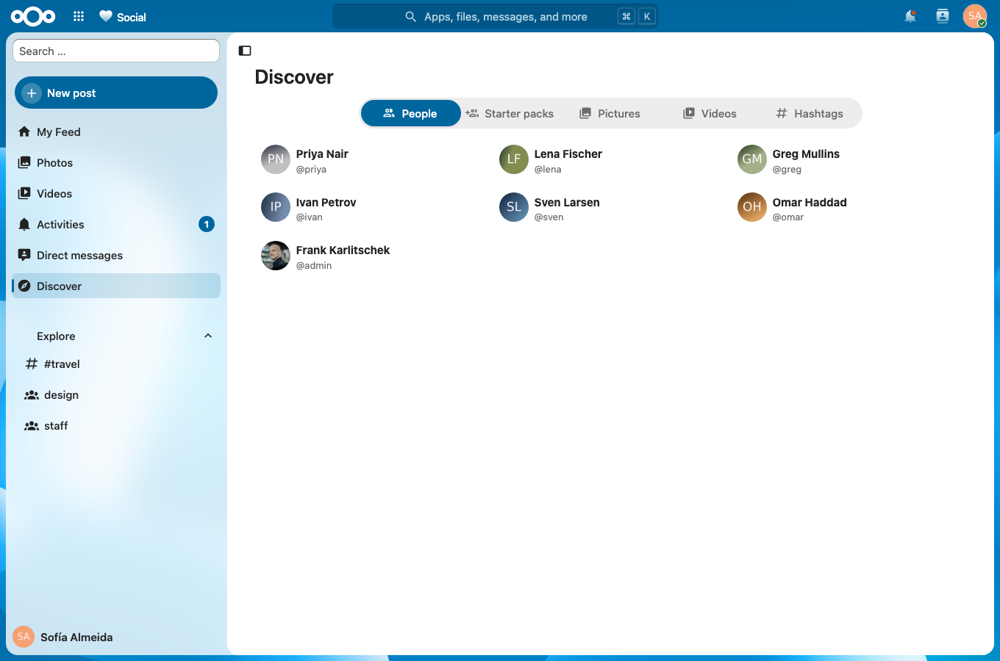

The hardest part of a new Fediverse account is the first ten follows. This answers it
four ways:

- **The people you already share a Nextcloud with.** Every Nextcloud profile has a
  `fediverse` field; this app fills in yours and reads everybody else's, so your
  colleagues are suggested before any algorithm has a thing to say.
- **Starter packs** — a named handful of accounts with one button that follows all of
  them. Administrators curate their own.
- **Trending hashtags**, ranked over a window you choose from one hour to ten days. The
  busiest hour and the busiest ten days are genuinely different lists, not one list
  relabelled.
- **Trending pictures and videos.**

The sidebar has its own way in: **Explore**, one collapsible entry holding the
hashtags you follow, your lists, and what this server is busy with right now — in that
order, because the first two are things you chose and the third is not. It shows as
much as the rail has room for, and what you follow is never pushed out by what happens
to be trending.

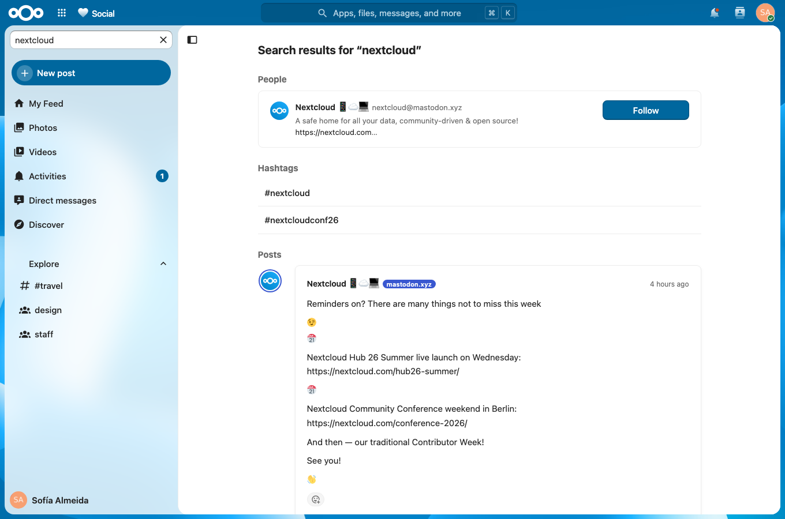

Search covers people, hashtags and the **full text of every post you are allowed to
see** — your own, public content and anything addressed to you — through Nextcloud's
own unified search. No external search engine to run.

## 👤 Your profile

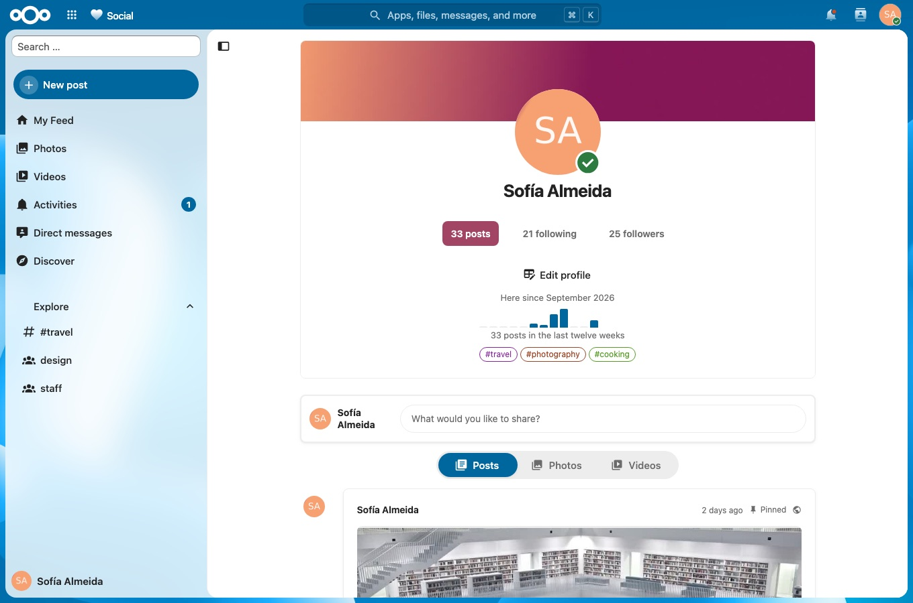

- **Posts, Photos and Videos** as three tabs, each one a question asked of the server.
- **A banner, a bio and four metadata fields**, federated the way Mastodon does it and
  edited in **Edit profile** on your own profile.
- **Verified links.** A profile field naming a web page gets the tick when that page
  links back with `rel="me"` — from an `<a>` anywhere on it or a `<link>` in its head.
  The editor says which of your fields are verified and when each was last proved, and
  hands you the line to paste on the far end. The page is fetched in the background,
  once a day per account.
- **Featured hashtags.** Up to ten tags pinned under the bio, saying what the account is
  about in its own words; a visitor clicks one and reads what was posted under it, with
  the count taken from the posts rather than stored. You set your own in **Settings →
  Featured hashtags**, which starts from the tags you already post with most instead of
  an empty box, and your profile links straight there.
- **Highlights** — a twelve-week posting chart and the tags somebody keeps coming back
  to.
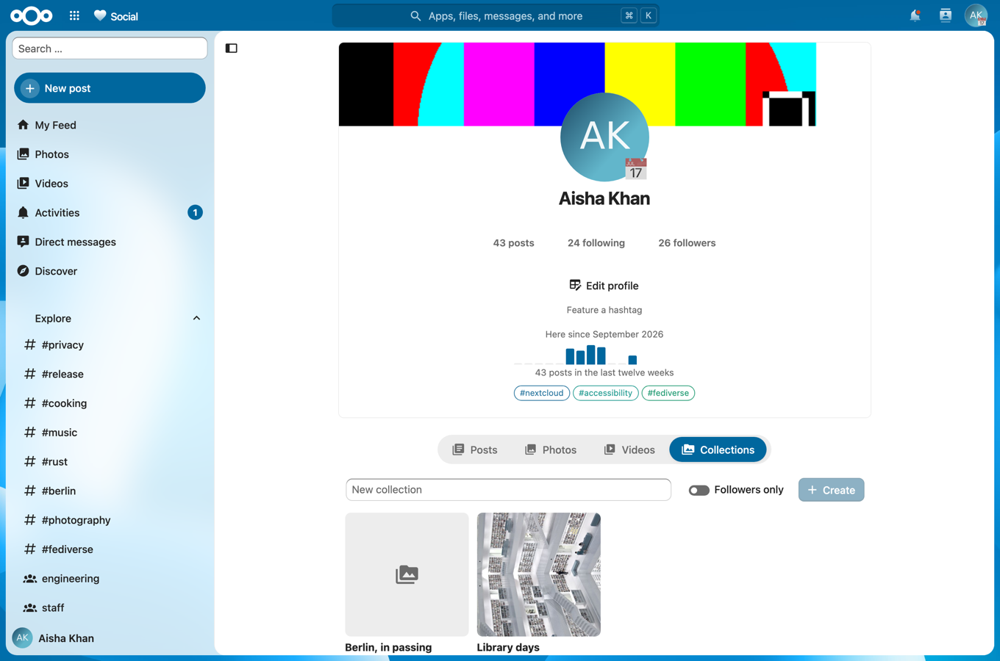

- **Collections** — Pixelfed's albums, as a tab of a profile: a shelf of the
  account's collections, each a page of its posts drawn as the profile grid. You make
  one on your own shelf, put a post into it from the post's menu (**… → Add to a
  collection**), and edit, empty or delete it on its page. A collection holds only
  its owner's own posts with a picture or a video in them, and a followers-only one
  is shown to followers and nobody else.
- **Team accounts** — an administrator can give a Nextcloud group an account to
  post from, and everybody in the group finds it in the composer beside the
  audience picker. It is an actor like any other: followable from Mastodon and
  Pixelfed, moderatable, with its own followers. The membership is the group,
  asked live, so leaving it takes the account away with it. Who wrote each post
  is recorded and shown to the team and to moderators, and to nobody else.
- **Your year, as a report** — Mastodon's `#Wrapstodon`: twelve months of what
  you posted and who arrived, the hashtags you used, the three posts that
  travelled furthest, and a one-word description of how you use the account.
  Computed from the posts already here, so it cannot go stale and needs no job
  to run.
- **Quote controls** — who may quote each of your posts (anybody, your
  followers, nobody), who already has, and a button that detaches one and tells
  their server. Mastodon 4.5's `quote_approval_policy`, its quote list and its
  revoke, over FEP-044f.
- **Relays** — subscribe to one and a new server's federated timeline stops
  being empty: a relay rebroadcasts the public posts of every server on it, and
  carries this server's public posts out to all of them. Public posts only, and
  a relayed post arrives as the post it is rather than as a boost by the relay.
- **Delete your Social account** from Settings, keeping your Nextcloud one —
  the posts, the follows and a `Delete` to every server that knew you. No
  administrator, and no password to type for an account signed in through SSO.
- **Authorized apps** — every app holding a key to your account, with what it
  may do and when it was last used, and a button that signs one out. The page
  to open after losing a phone.
- **Filtered notifications** — the senders your notification policy is holding,
  one row each, with Show these and Dismiss. The policy has been in the API since
  4.3; this is the page that makes it usable.
- **Hide a whole server** from yourself, beside the blocked and muted accounts.
- **Edit history** — the "Edited" line under a post opens every version of it.
- **A portfolio** — a page of your work with its own public address, to put on a
  CV. A title, a sentence, a grid or one picture at a time, and the pictures
  chosen from your recent public photos or one of your collections. A draft until
  you publish it; readable without signing in once you do, and built only out of
  public posts whatever else is set.
- **Videos that play elsewhere** — an administrator can turn on a background job
  that converts stored videos to H.264 in an MP4, which is the one format the rest
  of the network plays: Pixelfed's default accepts `video/mp4` and nothing else, so
  a `.mov` straight off a phone was being dropped by its inbox without a word.
  Off by default, because re-encoding is lossy and it is somebody's file, and never
  during an upload.
- **Tag people in a photo** — name the people in one of your own pictures from the
  post's menu (**… → Tag people**), and their names show up under it, linked to their
  profiles. Everybody named is told, and the photo appears under **Tagged** on their
  own profile — including on another server, because each name is written onto the
  post as a mention and the post is sent again. It does not change who may see the
  post. Anybody named can take their own name off, which needs nobody's permission.
- **Pinned posts**, up to five, published in the actor's `featured` collection. Remote
  accounts' pins arrive too.
- **A grid or a timeline**, whichever you last chose, cropped to each picture's focal
  point.
- **A private note** about somebody, for you alone. It never leaves this server and the
  person it is about is never told.

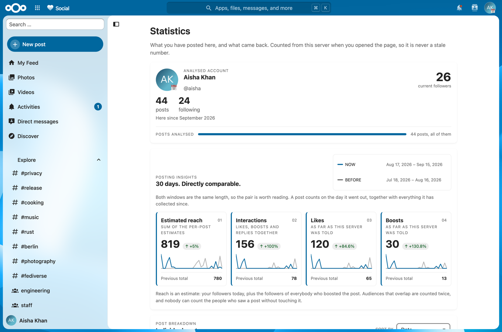

- **Your own statistics**, behind your face in the sidebar. **The last 30 days beside
  the 30 before them** — estimated reach, interactions, likes and boosts, each as a
  figure, the percentage it moved by and a line drawn over the window with the previous
  one behind it — and then **every post of the window, one by one**, with what it
  reached and what it collected, ordered by date, reach or engagement. Under that: which
  kind of post does better, the weekday and the hour that work, the tags worth using,
  where your followers are and when they arrived. Everything is counted from this
  server's own rows the moment you open the page, so nothing can be stale, and the page
  says what it cannot know — reach is your followers plus the followers of whoever
  boosted you, overlapping audiences counted twice, and it names how many boosters'
  audiences this server has never been told about.

## 🔔 Notifications

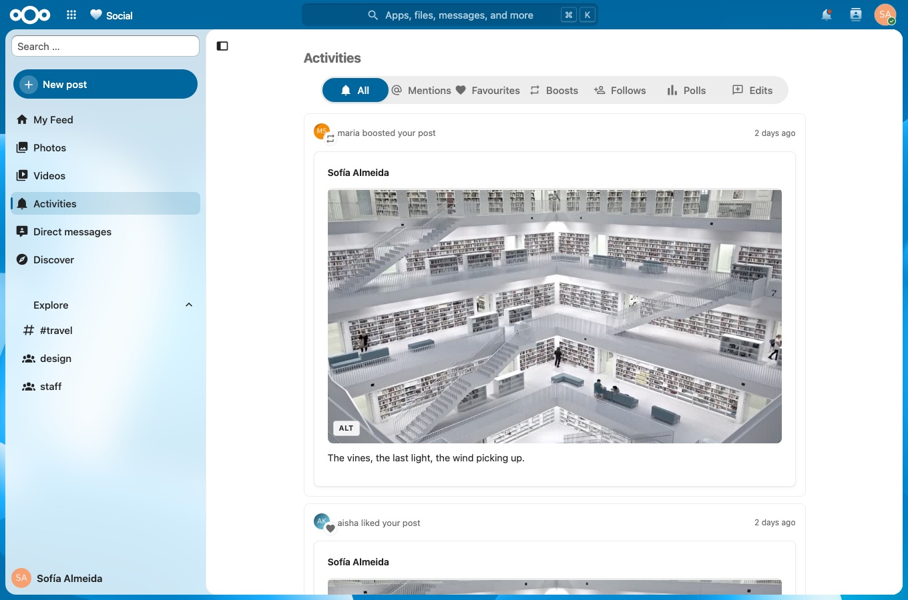

A page, not a list of everything. Filters across the top (All, Mentions, Favourites,
Boosts, Follows, Polls, Edits), a **New** line where you left off, and a run of likes of
the same post drawn as **one card with the faces stacked** rather than the same post
quoted twelve times.

It marks itself read after it has been in front of you for two seconds, not the instant
it renders — so it stops clearing the badge on your phone for things nobody saw.

**Who may reach you.** Five questions about whoever is writing to you — do I follow
them, do they follow me, are they new here, is this a private mention, has this server
limited them — each answered *accept*, *hold* or *drop*. What is held waits in a
requests inbox, gathered one row per account, so you decide about the account once
instead of about each notification in turn. Nothing is held unless you ask for it, and
nothing held is ever deleted: a policy you loosen next week can still show what it
caught this week. Clients read it as Mastodon 4.3's notification policy, and read the
same notifications grouped — "eight people favourited your post" rather than eight
rows.

**Nextcloud's own bell rings too.** Mentions, favourites, boosts, new followers, follow
requests, edits of posts you boosted and polls you voted in all reach Nextcloud
notifications and its mail digest, each linking into this app rather than out to a
remote server. A **follow request carries Accept and Decline on the bell entry itself**.

## ⚙️ Your account, your data

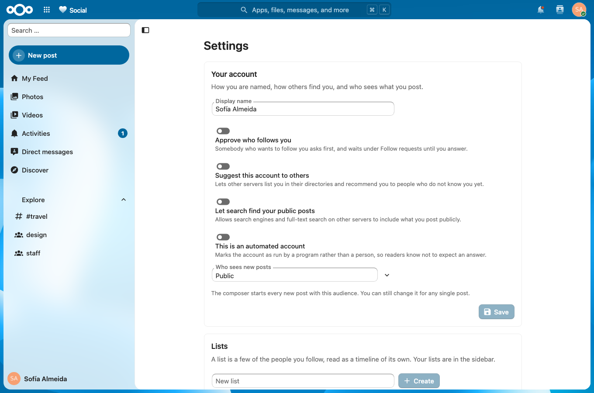

Everything about your account in one page: the name you publish under, whether people
must ask before they follow you, whether other servers may suggest you and index your
public posts, whether this is an automated account, and the audience every new post
starts with. Only what you changed is sent, so a display name your Nextcloud gets from
elsewhere is never written back.

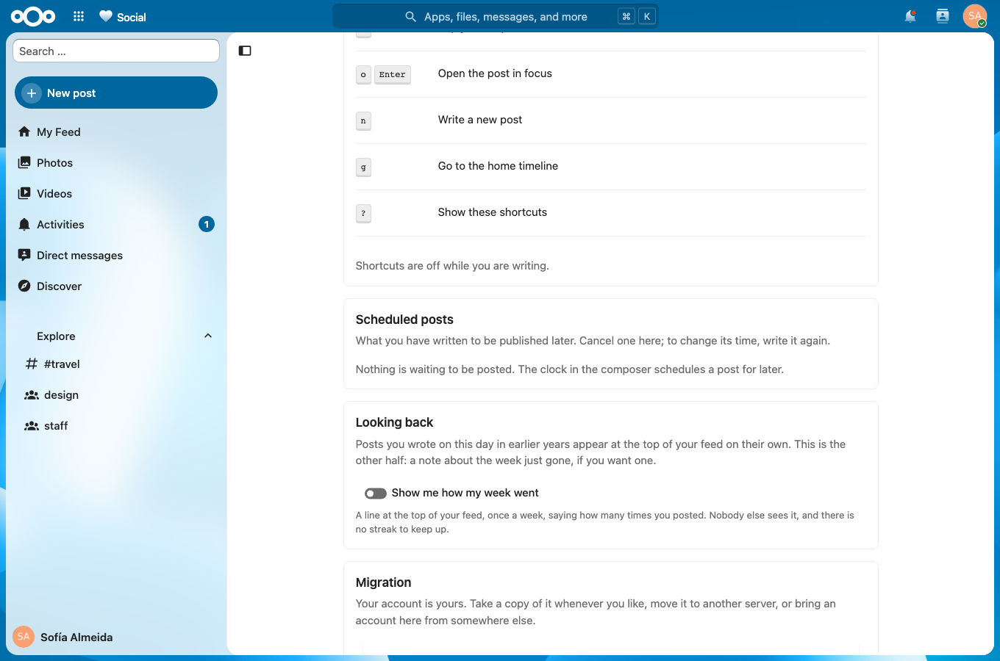

Below it: your **lists**, your **scheduled posts** with a way to cancel one, your
**blocked and muted accounts** with unblock and unmute inline, and **migration**.

**Migration takes your account with you.** Export writes your profile, follows,
followers, blocks, mutes, bookmarks, likes and every post you have written to a zip —
and **the pictures and videos come with it**, copied into the archive in the layout
Mastodon's own export uses, with each attachment pointing at the copy rather than at
the server you are leaving. Import reads one back, including an archive from
`occ user:export`. A third section brings your follows over from Mastodon, Pixelfed,
GoToSocial or Akkoma via their `following_accounts.csv` or `pixelfed-following.json`.
Your private key is deliberately not in the archive. Naming the account you are
moving from — the `alsoKnownAs` the old server insists on before it will hand over
your followers — is a field in the same page rather than an `occ` command, because
it federates nothing and is yours to set.

**And a fourth brings the posts** — the one thing moving between Fediverse servers has
never carried. Upload the export from your old server (this app's archive, Mastodon's
or GoToSocial's `outbox.json`, or Pixelfed's `pixelfed-statuses.json`) and the posts in
it are written here as yours, dated when you wrote them, with their pictures: out of
the archive where it holds the files, and off the old server where the export only
lists their addresses. **Nothing is published again** — not one delivery is queued, so
your followers do not get years of posts in an afternoon — boosts and direct messages
are left out, a reply keeps the post it answers where the file holds both, and
importing the same file twice changes nothing the second time. An archive too large
for a browser goes through `occ social:account:import-posts`.

  **Instagram's archive is read too** — the way most people arrive at Pixelfed. Ask
  Instagram for your information *in JSON* (the HTML download holds the pages and not
  the posts, and says so if you try it), and the posts, reels and their pictures come
  across with their captions and the hashtags written in them. Instagram's archive says
  nothing about who could see a post, so they are posted with **your own default
  visibility**; stories, archived posts and deleted ones are deliberately left where
  they are.

## 📱 On a phone, and in the dark

<p align="center">
  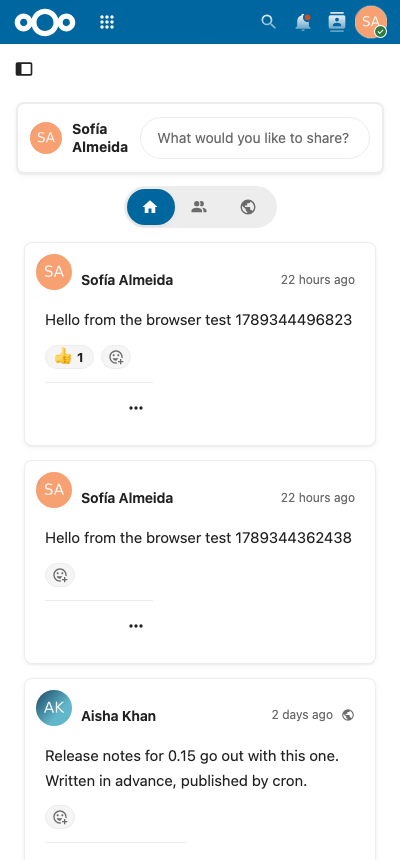
  &nbsp;&nbsp;
  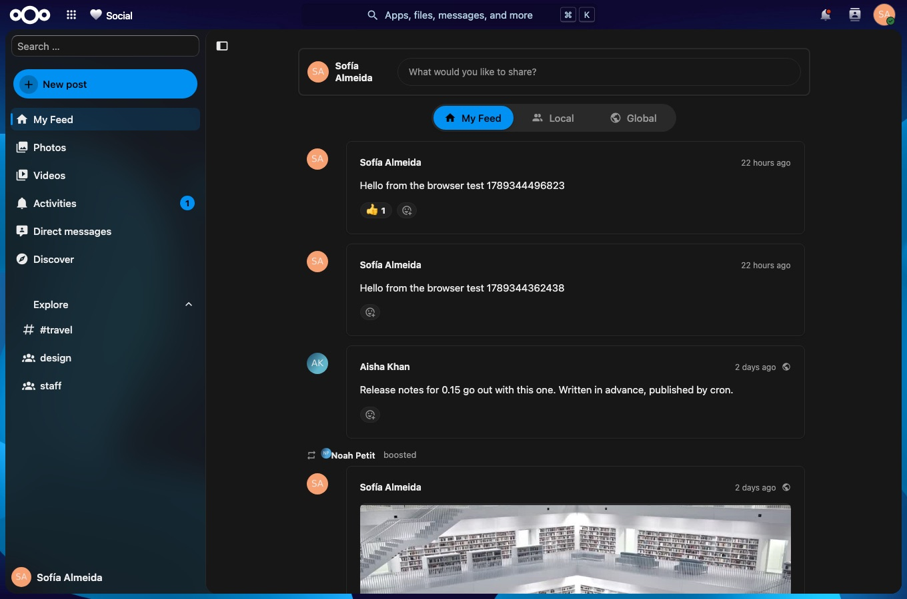
</p>

Under 600px the avatar moves inside the card, the card takes the width of the screen,
the composer's toolbar wraps instead of pushing Post off the edge, and a post's page
gives up the column it kept for an avatar that is no longer beside it. Dark mode is
the same app, not a second design.

## 🧩 It is a Nextcloud app, so it behaves like one

- **Share to Social, from Files.** Select a picture or a video — up to ten — pick
  *Share to Social* from the menu, and the composer opens with them already attached.
  Nothing is uploaded a second time.
- **Links unfurl.** Paste a link to a post or a profile into a Talk message, a Text
  document or a Deck card and it becomes a card with the author, the text and the first
  picture. Only what anybody could read is rendered, because the card is cached once
  for everyone who sees the link.
- **Nine Dashboard widgets** and an entry in the **contacts menu**.
- **The Activity app** lists your follows, mentions, boosts and favourites, and puts
  them in the Activity digest mail. Activity's own notifications stay off: the bell is
  the bell.
- **Unified search**, so Social posts turn up where every other search result does.
- **Deleting a Nextcloud user takes their Fediverse account with it** — tombstoned,
  dropped, and a `Delete` federated so other servers drop their copies too.

## 🛡️ Safety, and privacy that is the default

- **Block** to sever a relationship in both directions and hide somebody everywhere.
- **Mute** to hide them from your timelines and optionally your notifications without
  them ever knowing — **for an hour, a day, seven days, thirty, or until you lift it**.
  A profile says when a timed mute runs out.
- Both are offered on the profile **and in the menu of any post they wrote**, which is
  usually where you decided.
- **Report** an account or a post. With forwarding on, a report about a remote account
  also reaches the instance that hosts it — anonymised, and signed as this server
  rather than as the person who filed it, because they would otherwise be handing their
  handle to the very instance they are complaining about.
- **Locked accounts**, so follows must be approved, with a Follow requests page.
- **Keyword filters**, written and read in **Settings → Filtered words**: they are
  yours alone, they apply to every timeline this app draws, and a filter set months ago
  from a phone is finally visible from here.
- **What you see from an account you follow**, on its profile: the bell that says
  "tell me when they post", and its opposite number — **hide their boosts**, which
  keeps what somebody passes on out of your timelines while leaving everything they
  write themselves.
- **Per-user domain blocks** and conversation mute, through the API.
- **Nothing is sent to a third party.** No geocoder — a place on a post is one this
  instance has seen or one you name yourself, because sending somebody's location to a
  stranger at the moment they are deciding whether to publish it is exactly the failure
  the Exif stripping exists to prevent. Link previews are read by this server, never
  federated, and never fetched from a local address.

## 🏛️ For administrators

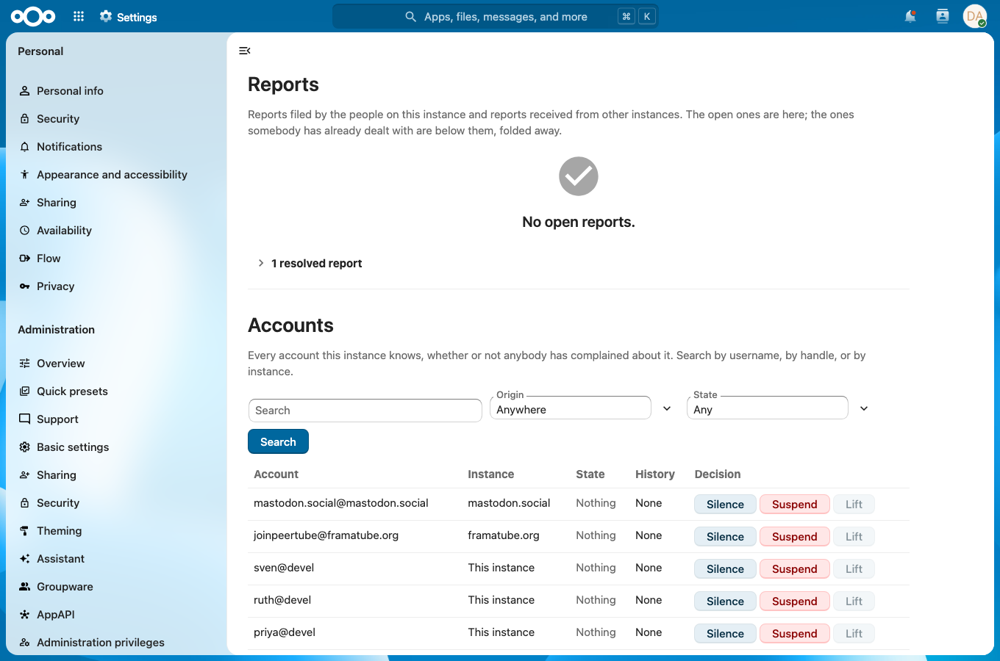

Everything in Administration → Social, built out of the same components as the rest of
the administration settings:

- **Reports** with **Silence**, **Suspend**, **Lift** and take-a-post-down, each
  recorded with the moderator who did it and written to Nextcloud's audit log.
  Suspending deletes what the account posted here, and the confirmation says so.
- **A review queue before anything goes out.** The first post of an account that has
  published nothing here yet, and posts that trip a very short list of spam rules —
  a wall of links, a scatter of mentions from an account nobody follows — wait for a
  moderator instead of reaching anybody. A held post is stored as the request the
  client sent and is written to no timeline at all, so there is no read path that
  could leak one; its author is told at once, can see it in their own settings, and
  can take it back. Publishing sends it as an ordinary post; refusing deletes it and
  tells them. Both rules are switches — the spam rules on by default, first-post review off
  until an administrator with open registration turns it on — and a **direct message is
  never held**.
- **An account browser** over every account this instance knows, with the standing
  decision and the strike history against each one.
- **Federation health** — how many deliveries are waiting, how many keep failing, which
  instances they are stacked up against, how close each is to being abandoned (**16
  attempts**), and which instances have been given up on in the last seven days.
  `occ social:queue:status` prints the same summary and
  `occ social:queue:retry --instance HOST` puts one host's deliveries back.
- **Server settings with an interface** — contact address, instance description, upload
  ceilings, inbox rate limit, secure mode, whether the block list is published, whether
  self-signed certificates are accepted. Every one of these used to be an
  `occ config:app:set` key that almost nobody set.
- **Announcements** — a notice to the whole instance, optionally between a start and
  an end, that everybody reads at the top of their timeline and dismisses once.
  **Retention** and the **instance access list** (an allow-list or a deny-list of
  remote hosts, enforced both ways) are here too.
- **Domain blocks that clean up.** Adding a host to the deny list also removes what it
  already sent: its accounts, their posts, the follows in both directions and the
  deliveries still queued towards it.
- **Setup checks in Administration → Overview** — whether `.well-known/webfinger`
  answers, whether the address Social builds its ids from is still the server's,
  whether the delivery job has run lately, and whether anything is stuck.
  `occ social:check:install` runs the same four and exits non-zero, so a deployment
  script can ask.

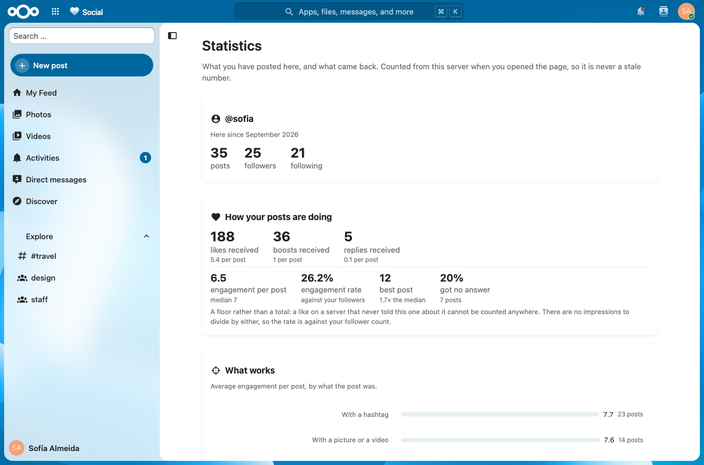

A **statistics** page for the instance, and Mastodon's admin API — accounts, reports,
domain blocks, IP and email-domain blocks, trends, measures and retention — for
anything you would rather automate.

Retention keeps the database honest: remote statuses older than `retention_days` that
nobody here interacted with are pruned with their attachments, and cached accounts
nobody follows are evicted after `cache_actor_days`. Local content is never touched.
`occ social:media:usage` says what the media is costing and how much of it is somebody
else's.

## 🔑 For developers

- **The Mastodon client API**, core surface plus OAuth 2: every timeline, posting with
  media and polls, follows, favourites, boosts, bookmarks, search, follow requests,
  reports, filters (both halves — keywords and per-status), conversations, markers,
  announcements, edit history, translation, Mastodon 4.3's grouped notifications with
  their policy and requests inbox, and the admin API. See
  [docs/API.md](docs/API.md) for exactly which routes exist.
- **Pixelfed's own routes** — the `/api/v2/config` bootstrap its app reads on launch,
  the `v1.1`/`v1.2` discover, story, collection, account, report and direct-message
  routes its screens call, its `push/*` routes answered honestly as off, and its
  `/api/admin/*` screens behind the same gate as Mastodon's admin API. Every limit in
  the config is derived from the one the server actually enforces. Of the forty
  Pixelfed-specific calls the official app makes, thirty-four are answered; the rest are
  Web Push and in-app registration.
- **Full ActivityPub delivery**: signed HTTP for `Create`, `Update`, `Delete`, `Like`,
  `Announce`, `Follow`, `Accept`, `Undo`, `Block`, `Flag` and `EmojiReact`, an outbound
  queue and a stream queue, both drained by background jobs and by
  `occ social:queue:process`.
- **Inbox forwarding**, so a reply from a stranger's instance reaches your followers —
  forwarded untouched and only when it carries its author's linked-data signature.
- **26 `occ` commands**, documented in [docs/OCC-Commands.md](docs/OCC-Commands.md).

> [!IMPORTANT]
> **Third-party Mastodon clients cannot reach the API yet.** Every route is served
> under `/apps/social/`, and the Mastodon client protocol has no way to be told about a
> non-root API base — so a client given your domain looks for `/api/v1/...` and finds
> nothing. Serving those paths at the domain root is the one thing standing between
> this and stock clients. See
> [docs/Mastodon-Compatibility.md](docs/Mastodon-Compatibility.md).

## 🚧 Not implemented yet

These are absent from the code today, not merely rough edges:

- **No streaming API and no push subscriptions.** Third-party clients poll. (The web
  client does get live timelines when
  [notify_push](https://github.com/nextcloud/notify_push) is installed — that is a
  Nextcloud channel, not a Mastodon one.)

## 📦 Quickstart (install & develop)

1. Clone this repository into your Nextcloud `apps/` directory.
2. Install the dependencies and build the frontend:

```bash
cd /var/www/nextcloud/apps/social
composer install     # PHP dependencies
npm ci
npm run build        # production bundle into js/
```

3. Enable the app in Nextcloud (`occ app:enable social`) and check the install with
   `occ social:check:install`.
4. While working on the UI, use `npm run dev` for a development build or
   `npm run watch` to rebuild on change. The `Makefile` wraps the same scripts
   (`make build-js`, `make build-js-production`, `make watch-js`, `make lint`).
5. To produce a release archive, run `make appstore` (or `./build-package.sh`,
   which is now a three-line wrapper around it — two copies of the exclusion list
   had already drifted apart, so there is one). It installs from the lock files,
   builds the frontend, stages the app without its development files and writes
   `build/artifacts/social.tar.gz`. It refuses to package when `js/.htaccess` is
   missing: that is a committed file rather than webpack output, and the target
   used to delete `js/` wholesale before building. Despite the `sign_dir` name it
   only stages and tars, it does not sign anything.

## 🧭 "`.well-known/webfinger` isn't properly set up!" — Troubleshooting

That banner has two quite different causes, and the app now tells them apart.

The first is the one it names: the server does not answer `/.well-known/webfinger`.
Follow the [documented redirects](https://docs.nextcloud.com/server/latest/go.php?to=admin-setup-well-known-URL).

The second is that **Social is set up for a different address than the server now
uses**. Social reads `overwrite.cli.url` once, the first time the app is opened, and
builds every account id, post id and WebFinger answer from that stored copy
(`social.cloud_url`). Change the server's URL afterwards and the two drift apart in
silence: WebFinger answers for a host nobody asks about, and the app blames
`.well-known` when `.well-known` is fine.

Social reports the mismatch with both addresses but will not correct it, because the
stored address is baked into every id already written. Either point
`overwrite.cli.url` back at the address Social knows, or accept the rename and run
`occ social:reset --uri=<new address>`, which deletes everything Social holds. It
asks twice; add `--force` to run it from a script (without it, `--no-interaction`
refuses rather than quietly doing nothing).

To see the two values:

```bash
occ config:app:get social cloud_url
occ config:system:get overwrite.cli.url
```

Administration → Overview reports both of these — and two more things that break
federation quietly — without anybody having to open Social. See
[docs/Admin.md](docs/Admin.md)
for the whole setup, every configuration key and what to watch.

## 🖼️ Banner / Header upload — Troubleshooting

Banner/header uploads work: the image is stored in the app's document cache, the
local actor's cached `header` is updated, and the change is federated as an actor
`Update` (`lib/Controller/LocalController.php`, `uploadBanner()`). A banner can also
be set from a URL. The upload goes through the same `filterMimeTypes()` list as an
attachment (`lib/Service/CacheDocumentService.php`), so every image type an
attachment may have is accepted — JPEG, PNG, GIF, WebP, AVIF and HEIC/HEIF (the
last converted on the way in); nothing narrows that list to pictures for a banner.

If an uploaded banner does not appear immediately:

- Reload the profile page (clear the browser cache if necessary).
- Check the server log for `[LocalController] uploadBanner failed` and for
  `Failed to federate banner change`, which is only a warning and does not undo the
  local upload.
- Re-fetch the account data, or run `occ social:cache:refresh`, to refresh the cached
  actor.

## ✅ Tests

Backend and frontend unit tests run without a Nextcloud server or database.

```bash
composer install            # PHPUnit + OCP interface stubs
composer run test:unit      # PHP: vendor/bin/phpunit -c tests/phpunit.xml

npm ci
npm test                    # JS: vitest run (tests/js/** and src/**/*.test.js)
npm run test:coverage       # with a coverage report in coverage/js
npm run typecheck           # tsc over the plain-JS half of src/, against src/types/
```

PHP tests live in `tests/` mirroring `lib/` (`lib/Service/PostService.php` →
`tests/Service/PostServiceTest.php`). Everything a class needs is mocked; the
server code that resolves a service statically — `OCP\Server::get()`, which
`Response` itself calls on every render — finds a `TestContainer` instead, which
knows a silent logger and a session with nobody in it and raises a named error
for anything else (see `tests/Helper/TestContainer.php`). Migration steps are
given a `FakeTable` that records the schema they ask for rather than building it
(`tests/Migration/`). Frontend tests use Vitest with
`@vue/test-utils` and jsdom; `tests/js/setup.js` provides the Nextcloud globals
(`t`, `n`, `OC`, `OCA`, `localStorage`, router webroots).

A second PHP suite in `tests/Integration/` runs against a real Nextcloud and
database — migrations, query SQL and storage boundaries the mocks cannot reach.
CI runs it on SQLite, MySQL and PostgreSQL; locally, point it at an installed
server:

```bash
NEXTCLOUD_ROOT=/path/to/nextcloud composer run test:integration
```

See `tests/Integration/README.md` for what it covers.

### Browser tests

`tests/e2e/` drives a real Nextcloud with the app installed, in Chromium,
through [Playwright](https://playwright.dev): sign in, open the app, write a
post and see it in the feed, walk the Discover page, switch scopes, open a
group list, add and remove a keyword filter, and check that a post of your own
offers to be deleted and written again. Nothing is mocked, and the bundle under test is the committed one
in `js/`. `.github/workflows/e2e.yml` sets up a throwaway server for every pull
request; against an instance of your own:

```
npx playwright install chromium
E2E_BASE_URL=https://cloud.example E2E_USER=alice E2E_PASSWORD=… E2E_GROUP="Design" npm run test:e2e
```

`E2E_GROUP` is optional — the display name of a Nextcloud group the account is
in, for the list test; without it that test is skipped.

## 🛠️ Contributing

- Contributions welcome — open a pull request and run the build and tests locally
  first (`npm run lint`, `npm test`, `composer run test:unit`).
- Reset local Social data for development with:

```bash
occ social:reset
```

  This prompts twice and then empties every Social table. `occ social:reset
  --uninstall` additionally drops the tables, migrations, background jobs and app
  config. See [docs/OCC-Commands.md](docs/OCC-Commands.md) for all commands.
- [docs/Admin.md](docs/Admin.md)
  is the administrator's guide: what federation needs before it works, every app
  configuration key with its meaning and default, the sections of the
  administration page, how moderation is recorded, and the occ commands by task.
- [docs/Mastodon-Compatibility.md](docs/Mastodon-Compatibility.md)
  answers how close this is to Mastodon in the three senses that can mean —
  whether its clients work, whether peers can tell the difference, and whether an
  instance could move onto it. Its last section is the backlog that follows:
  everything still between this app and a full replacement, in tiers, with what
  each item actually fixes and whether it is done.
- [docs/User-Guide.md](docs/User-Guide.md)
  is the guide for the people using the app: getting an account, following,
  posting, reading, managing the account, keyboard shortcuts.
- Before picking up refactoring work, read
  [docs/Technical-Debt.md](docs/Technical-Debt.md)
  — what in the app is old, borrowed or load-bearing, and what changing it would
  cost — and
  [docs/Performance.md](docs/Performance.md),
  which lists the query and scalability problems that are still open and the
  ones that have been fixed. Neither is checked by a test, so re-verify a claim
  before acting on it and update the file in the same change as the code.


## License

See the repository's license files in the `LICENSES/` directory.

---

<div align="center">

**[Admin guide](docs/Admin.md)** ·
**[User guide](docs/User-Guide.md)** ·
**[API](docs/API.md)** ·
**[occ commands](docs/OCC-Commands.md)** ·
**[Architecture](docs/Architecture.md)** ·
**[Mastodon compatibility](docs/Mastodon-Compatibility.md)**

Screenshots are of a development instance with seeded demo accounts.

</div>
